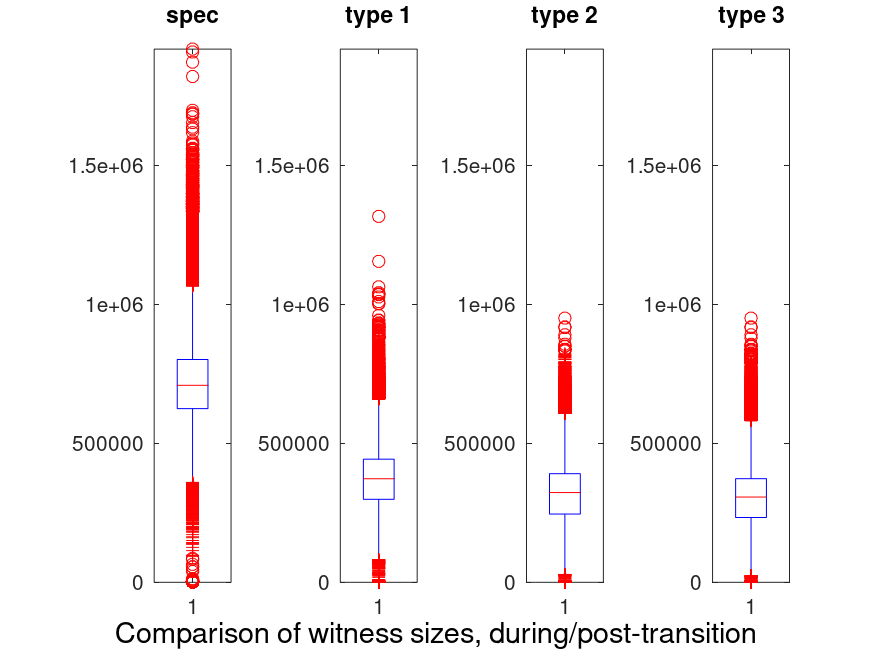
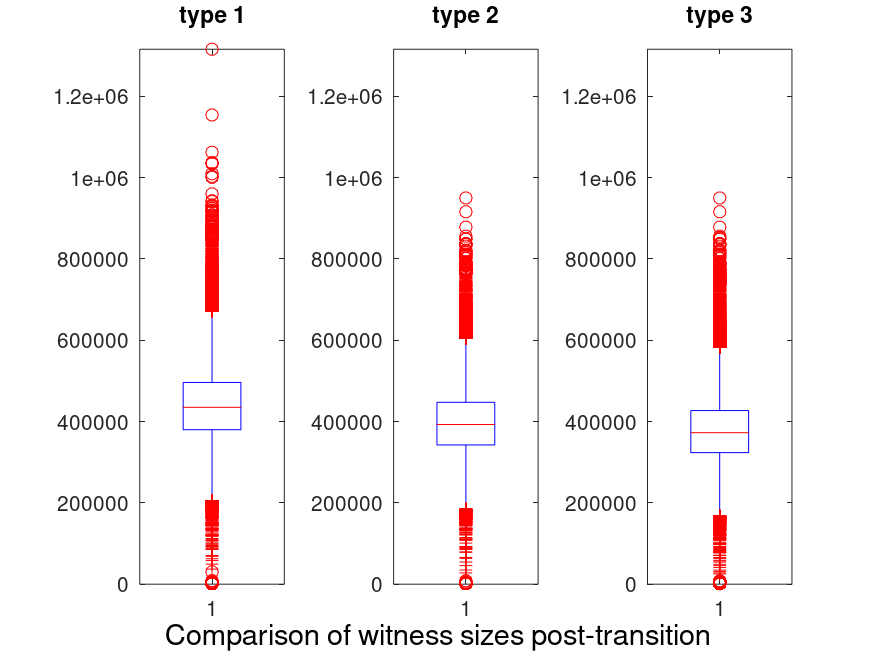
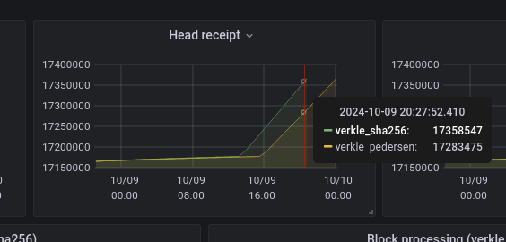

# Verkle replay

## Context

This data is gathered replaying ~200k historical blocks around the Shanghai fork. While they do not give a perfect view of how execution will behave once EIP-4762 is active, it still gives a good indication of what to expect, and how the spec should evolve.

## Witnesses

This section explores multiple dimensions of the execution witness design.

### Size

Research has been conducted, in order to determine the best structure for a witness. We tried four methods:

 * The first one, as specified in the [current version of the consensus spec](https://github.com/ethereum/consensus-specs/blob/dev/specs/_features/eip6800/beacon-chain.md#executionwitness), referred to as **type 0**. This approach uses the SSZ type `Optional[T]` , that is yet to be officially included in the spec.
 * A first variation of the spec, in which prestate values are grouped together in their own list, and poststate values are grouped in their own list as well. This is referred to as **type 1**.

```python
class SuffixStateDiffs(Container):
    suffixes: bytes
    # None means not currently present
    current_values: List[bytes]
    # None means value not updated
    new_values:     List[bytes]
```

 * A second variation of the spec, in which updates, insertions and reads are grouped in their own separate lists. The suffixes for each of these lists are also grouped as their own byte lists. This is referred to as **type 2**.

```python
class SuffixStateDiffs(Container):
    updated_suffixes: bytes
    updated_currents: List[Bytes32]
    updated_news: List[Bytes32]

    inserted_suffixes: bytes
    inserted_news: List[Bytes32]

    read_suffixes: bytes
    read_currents: List[Bytes32]

    missing_suffixes: bytes
```

 * A final variation, where update, reads, inserts and proof-of-absences are grouped, along with their suffixes, into their own lists. This is referred to as **type 3**.

```python
class UpdateDiff(Container):
    suffix: byte
    current: Bytes32
    new: Bytes32

class ReadDiff(Container):
    suffix: byte
    current: Bytes32

class InsertDiff(Container):
    suffix: byte
    new: Bytes32

class MissingDiff(Container):
    suffix: byte
class StemStateDiff(Container):
    stem: Bytes31

    updates: List[UpdateDiff]
    reads: List[ReadStateDiff]
    insert: List[InsertDiff]
    missing: List[MissingStateDiff]
```

Here are our findings after replaying data:



One can see that the spec is much less efficient than the other types. This is due to the inefficiency of storing `Optional[T]`. As a result, we didn’t include this method in the rest of the analysis.

When only considering witnesses that were produced after the whole state was [converted to verkle](../state-conversion/intro.md), this is what is found:



The maximum and minimum observed sizes for each type, are summarized in the following table:

|Name|Min (KB)|Max (KB)|
|-|-|-|
|type 1|425|1285|
|type 2|383|928|
|type3|380|928|

While type 2 and type 3 are quite close, one can see that type 3 has better average and minimum sizes.

### Witness size breakdown (type 3)

Replaying past blocks, we generated the witnesses and could provide the following size breakdown for type 3 witnesses. This is averaged over ~134k blocks, as the conversion blocks were skipped.

|Component|avg size %|min size %|max size %|
|-|-|-|-|
|keys|13|9|49|
|pre-values|78|7|85|
|post-values|0.1|0|47|
|verkle proof|12|8|77|

### Takeaways

The key takeaways are:

 * Type 3 witnesses offer a great compression.
 * Although post-state values don't take much size on average, they can take up almost half of it in the worst case. It would make sense to remove them, as validating them requires block execution.

## Database

Looking at a fully converted database (conversion + ~134k blocks replayed), we found that the leaf depths could be broken into :

|Depth|Count|Percentage|
|-|-|-|
|4|745822024|80.6|
|5|178484052|19.3|
|6|775718|0.1|
|7|2880|0|
|8|10|0|

<!-- ## Gas usage -->

## Execution performance

This section looks at what part of verkle causes a performance hit and what part improves performance.

### Impact of key hashing

In order to estimate the performance impact of Pedersen key hashing, this is a comparison of how long it takes to replay 200k mainnet blocks using Pedersen hashes, vs. sha256:



At the end of the sha256 run, so >200k blocks later, the chain was 75072 blocks ahead. This represents a loss of 3 hours per day against sha256. That’s ~12% faster.

Coupled to the fact that Pedersen hashes aren’t quantum resistant, it seems like a good idea to reconsider using Pedersen hashes to compute trees.

On the other hand, adding a new hash function could increase the complexity of future chain SNARKification effort. Chosing Poseidon as a hash function might be an exception, although its overall performance would have to be evaluated once it's deemed secure.
