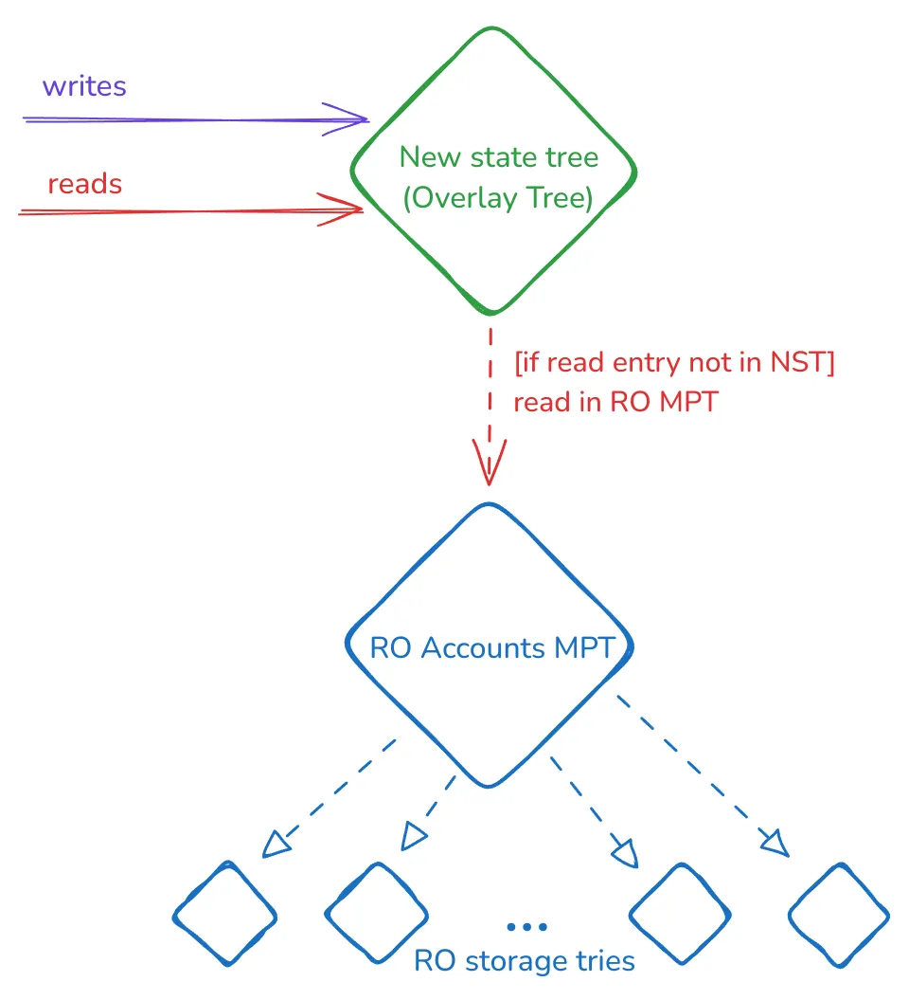

# EIP-7612

- [EIP-7612](#eip-7612)
  - [Overview](#overview)
  - [Read and write rules](#read-and-write-rules)
  - [Block state root](#block-state-root)
  - [State proofs and syncing](#state-proofs-and-syncing)

## Overview

Two EIPs are proposing a new tree to replace the Merkle Patricia Trie(s) (MPT). For more information, refer to EIP-6800 and EIP-7864.

The [EIP-7612](https://eips.ethereum.org/EIPS/eip-7612) describes the first step in this transition. Although its title mentions Verkle Trees, it can be applied to any target tree. It is also a stepping stone in a more general strategy for a full tree conversion.

This EIP approach is simple: introduce the empty new tree (*Overlay tree*) while keeping the existing MPTs, which are now read-only. This construction can be depicted as:

## Read and write rules

When the EIP is activated (i.e., [FORK_TIME](https://eips.ethereum.org/EIPS/eip-7612#constants)), this *Overlay Tree* works in the following way:

- On a write operation for a key:
  - Store it in the new tree.
  - We **don’t** delete, update, or insert the key in the MPT, being the account or storage trie for an account. MPTs are read-only and can (and will) have missing or stale values.
- On a read operation for a key:
  - Read the key in the new state tree:
    - If the key exists, return its value. If it doesn’t, move to the next step.
    - Read in the corresponding account/storage trie and return the result.

## Block state root

For all the blocks after the EIP activation timestamp, the block state root is the root of the introduced tree. The read-only account MPT root won’t be part of the block, but since it’s read-only, we can assume its root is the latest block before EIP activation.

## State proofs and syncing

Please refer to the corresponding sections in the *State Conversion* chapter: State Proofs and Syncing.
