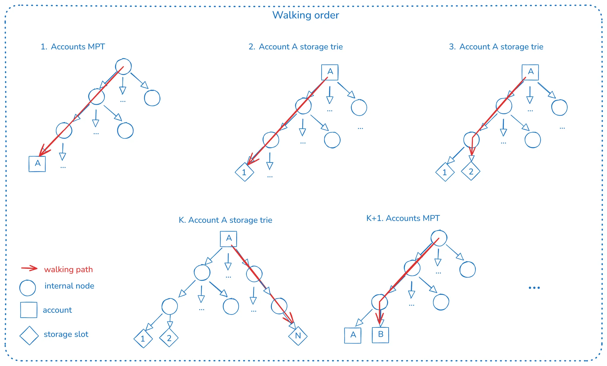

# EIP-7748

- [EIP-7748](#eip-7748)
  - [Recommended background](#recommended-background)
  - [Big picture](#big-picture)
  - [CONVERSION\_STRIDE value](#conversion_stride-value)
  - [Conversion units](#conversion-units)
  - [State conversion duration](#state-conversion-duration)
  - [Stale data](#stale-data)
  - [Pre-EIP-161 accounts](#pre-eip-161-accounts)
  - [Preimages](#preimages)

## Recommended background

We highly recommend reading the high-level explanation for state conversion in the [*State Conversion* chapter](./intro.md) and the [EIP-7612 explanation](./eip-7612.md).

## Big picture

This conversion EIP can be compactly described as:

> Starting at block with timestamp greater or equal to CONVERSION_START_TIMESTAMP, on every block migrate CONVERSION_STRIDE conversion units from the read-only MPTs to the active tree. Do this until no more conversion units are remaining.

To migrate the data from the MPT(s) to the new tree, a deterministic walk is done in the MPT(s), moving *conversion units* to the new tree. We’ll explain *conversion units* soon, but let’s focus only on the walking algorithm.

The walking algorithm is a depth-first walk, meaning that we walk the account’s MPT, and when a leaf is found, we do a depth-first walk into its storage trie (if not empty).

The above image summarizes how the walking is done:

- When we reach account A, we walk into its storage trie, copying all storage slots to the new tree.
- After finishing the storage trie walk, we copy `Account A` data (nonce, balance, and [chunkified code](../code-chunking/intro.md)).
- We continue walking the account’s MPT, now standing on account B.
- We walk the storage trie (if any, since if B is an EOA, this tree is empty) and continue the process.

Since all the MPTs are read-only from the start of the conversion process, the walk is guaranteed to be complete, and thus, the conversion will finish.

This process of walking and copying is done within the block execution pipeline, where only *CONVERSION_STRIDE* items are copied to the new tree. The walk and copying continue to the next tree, so the whole copying process spans multiple blocks. This is done to put a bound on the overhead of state conversion per block.

## CONVERSION_STRIDE value

Choosing the correct value for CONVERSION_STRIDE is important since each step of the walk implies:

- CPU overhead of re-hashing the corresponding key.
- IO overhead since we’re copying data to the new tree.
- CPU overhead is added to the block state root computation since the new tree has extra writes apart from the ones generated by the execution of the transactions.

Previously run proof of concepts done in Geth for Verkle Trees has shown that the CPU overhead of re-hashing the keys is the main bottleneck. But note that Verkle Trees have orders of magnitude more CPU overhead compared to Binary Trees, which are considered hash functions, so it depends on the target tree.

## Conversion units

The EIP introduces a concept of conversion units to precisely describe what counts as a moved item for the CONVERSION_STRIDE limit. As currently defined, a *conversion unit* is:

- Account data: nonce, balance, code hash, and code (if any).
- An account’s storage slot.

Note that one conversion unit implies **one or more** leaf insertions in the new tree. Both Verkle and Binary propose a unified tree that includes accounts data, storage slots, and accounts chunkified code:

- An account conversion unit implies creating **at least** two new tree entries:
  - [BASIC_DATA](../trees/intro.md#encoding) leaf, containing the version, nonce, balance, and code size.
  - [CODE_HASH](../trees/intro.md#encoding) leaf, containing the code hash.
  - Depending on the [code-chunk size](../code-chunking/intro.md), we’d have to insert N leaves corresponding to each code chunk for the account’s code (if any).
- A storage slot conversion unit implies creating exactly one entry since each storage slot is also a single leaf in the new tree.

The proposed EIP includes in its [rationale](https://eips.ethereum.org/EIPS/eip-7748#state-conversion-step-position-in-block-execution) an important point on why we don’t count each code chunk as an independent conversion unit:

> If an account has code, this is chunked and inserted in the VKT in one go. An alternative is including a `CodePhase` and let each inserted chunk consume one unit of `CONVERSION_STRIDE`.
> We decided to not do this to reduce the algorithm complexity. Considering the current maximum code size, the worst case scenario for a block could overflow the `CONVERSION_STRIDE` limit by 24k/31~=793 units.

At first, this concept might sound over-engineered, but this is because the old tree (MPTs) and the new tree (Verkle/Binary) don’t have the same data in leaf levels. First, the MPTs don’t contain an account code but only the code hash, while the new tree includes code chunks as tree entries. Also, account data such as nonce, balance, and code hash are stored in a single MPT leaf but in more than one in the new tree.

## State conversion duration

Considering that the MPTs are read-only, we can determine how many conversion units should be found in the walking. Since we know we copy up to CONVERSION_STRIDE conversion units per block, we can calculate how many blocks the conversion will take.

Note that the migration happens per block and not per slot. The wall clock duration of the conversion process depends on how many missed slots happen in the chain during the conversion process.

## Stale data

Note that there are many ways in which a conversion unit we intend to move to the new tree contains stale data and **must** avoid overriding the value:

- Before EIP-7748 activation, [EIP-7612](./eip-7612.md) was activated; thus, the new tree was already getting writes from previous block executions. This means that for a key in the MPT, a more recent value can already exist in the new tree.
- If that didn’t happen before the state conversion started, it can happen during the conversion anyway.

Some examples:

- Conversion unit corresponds to the account’s data: if there was a previous transaction execution that wrote to the account's balance, this means the MPT balance is stale. Copying the code chunks is still required since transaction execution never triggers code chunkification *for existing contracts*.
- Conversion unit corresponding to accounts storage slot: a previous transaction could have triggered a write to the storage slot. Thus, the storage slot value in the MPT is stale. Although this value isn’t copied, it still counts since we had to check it.

## Pre-EIP-161 accounts

The state conversion is also an opportunity to delete EIP-161 accounts so we can clean them up once and for all instead of passively if they’re touched during block execution.

## Preimages

Moving the *conversion units* from the MPT to the new tree has a catch. Given an entry in the RO MPT, it will live in a different tree key in the new tree since the new tree defines a new way of calculating keys.

This means that the new key has to be computed, so you require the preimage of the MPT key since it’s a hash. This is a big topic that we’ll [dive more into next](./preimages.md).
