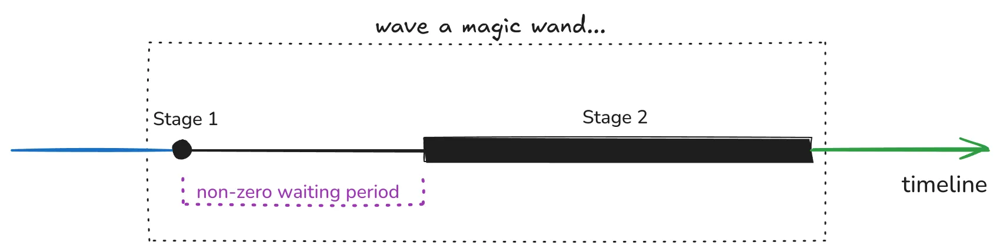
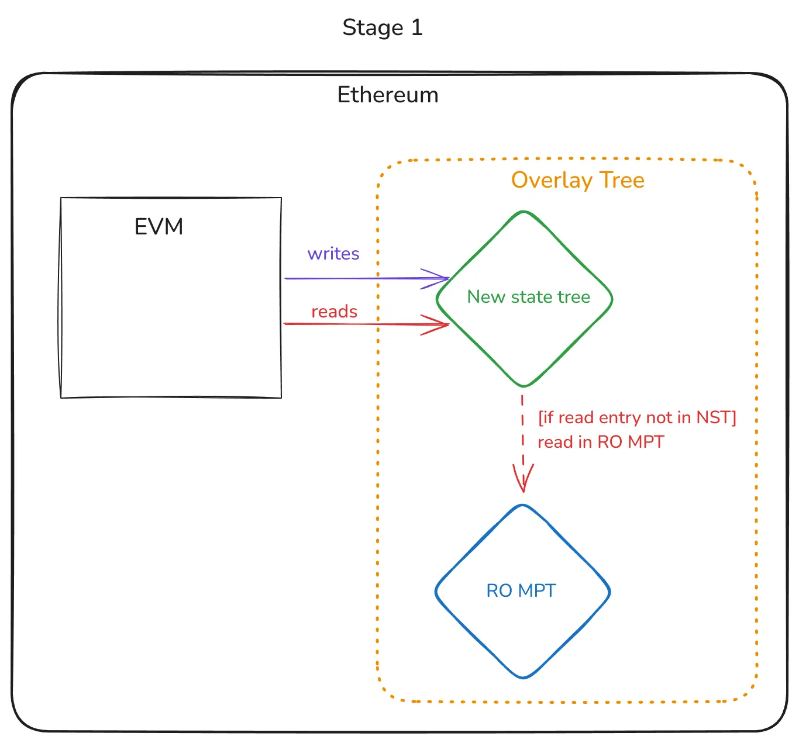
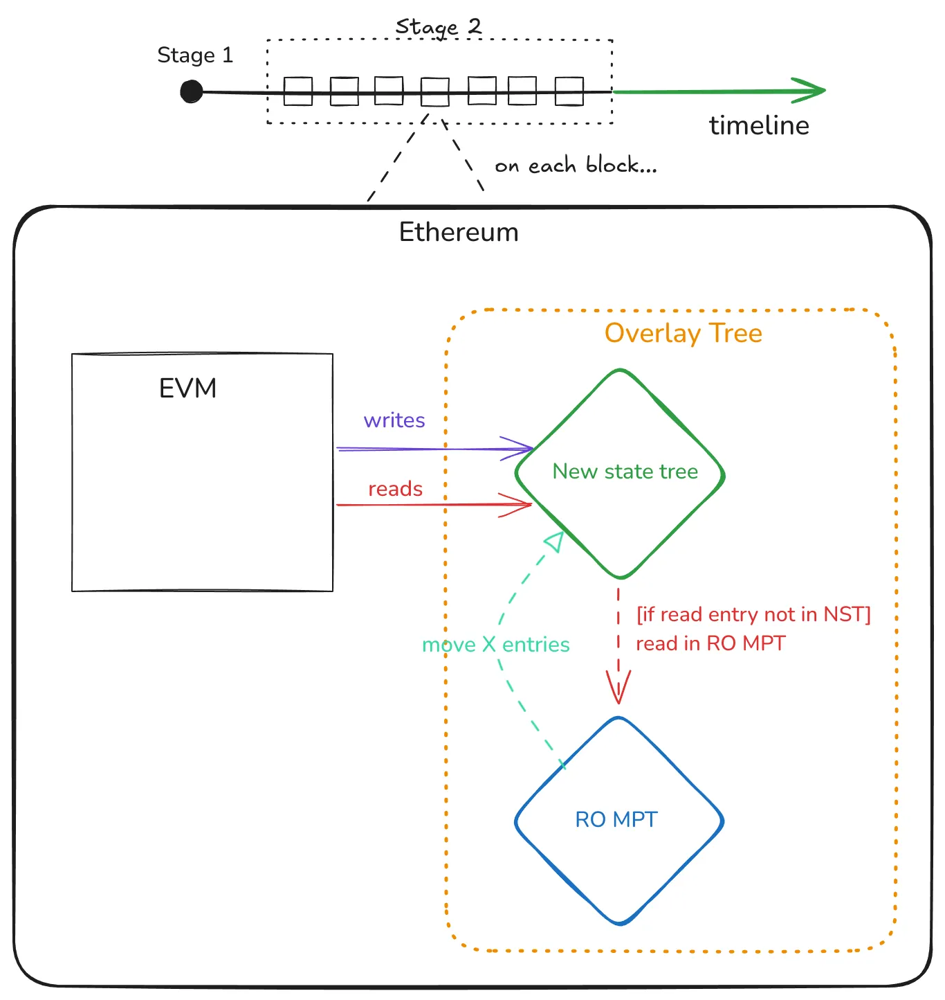

# State conversion

- [State conversion](#state-conversion)
  - [Introduction](#introduction)
  - [Motivation](#motivation)
  - [Big picture](#big-picture)
    - [Stage 1 - Introduce the new tree](#stage-1---introduce-the-new-tree)
    - [Waiting period…](#waiting-period)
    - [Stage 2 - Move the existing data from the MPT to the new tree](#stage-2---move-the-existing-data-from-the-mpt-to-the-new-tree)
  - [How are contracts, clients, and users affected during this conversion phase?](#how-are-contracts-clients-and-users-affected-during-this-conversion-phase)
    - [Users sending transactions](#users-sending-transactions)
    - [EVM contract execution](#evm-contract-execution)
    - [State proofs](#state-proofs)
    - [Syncing](#syncing)

## Introduction

*State conversion* is an important and complex topic for a stateless Ethereum. As mentioned in the *Trees* chapter, one required protocol change is changing the tree used to store the Ethereum state. Although it is easy to spin up a new blockchain with a new shiny tree, life is more complicated when you need to do it with an existing tree storing a state of ~300GiB.

This chapter explains how the protocol will switch the state tree to the new target tree while attempting to run seamlessly, flawlessly, and safely with minimal user impact.

In sub-chapters, we dive deeper into explaining more low-level spec proposals on how this is done in more detail and intricacies. We suggest readers read sub-chapters in order since each will rely on a good understanding of the previous ones.

## Motivation

To understand why we need to care about this problem, please read the [*Tree* chapter](../trees/intro.md) of this book. Going forward, we only need to understand that a new tree should be used, and somehow, it has to be introduced into the protocol.

Today's proposed strategy is converting the data with an *Overlay Tree*, which we explore in more detail in sub-chapters, but for now, let’s stick to the big picture.

## Big picture

Here’s a summary of what we want to achieve:

Unfortunately, we can’t *wave a magic wand* and call it a day, so the current proposal will go in two phases.

Note that these two phases will happen while the chain runs as usual, so we’re changing the *system’s database while the system is running*! [Previous research](https://notes.ethereum.org/@parithosh/verkle-transition#Conversion-node-method) has explored offline conversion methods with other tradeoffs and risks.

### Stage 1 - Introduce the new tree

In *Stage 1,* a protocol change is activated (EIP-7612), which:

- Makes the MPT read-only (i.e., RO MPT).
- Introduces the new (empty) state tree.
- Any new write produced by executing transactions in a block is done in the new tree.
- Any read is first done in the new tree; if the key isn’t found, it is done in the RO MPT.

Note that in the timeline shown before, this stage 1 is a single point in the timeline. As soon as the timestamp activates EIP-7612, the goal of the EIP (i.e., introducing the new tree) is done. This EIP doesn’t deal with moving existing data, which is done by other EIPs, which we will explain soon.

We dive deeper into EIP-7612 in its corresponding sub-chapter.

### Waiting period…

There is a required period after *Stage 1* is activated before *Stage 2* can be activated. The goal is for the RO MPT from *Stage 1* to be final (i.e., the chain reaches finalization).

This is critical so no chain reorganization can mutate the RO MPT. Doing this greatly simplifies the implementation of EL clients since they know that not only is the MPT read-only but it’s completely frozen. Moreover, it simplifies the preimage generation and distribution tasks, but [we expand on this later in the book](./eip-7748.md#Preimages).

### Stage 2 - Move the existing data from the MPT to the new tree

Let’s unpack what this stage is about:

- The functioning of the Ethereum chain continues to be as we described in *Stage 1*, with a (finalized!) RO MPT, and the new tree with the defined read/write rules.
- An extra rule is added: on every block, we move a defined (X) number of entries in the RO MPT to the new tree. This is when we start moving the data from the old to the new tree.
- Since the MPT is read-only and we always make progress on each block, we’ll eventually reach the end of the conversion.

Note that this is a high-level explanation of the idea; we’ll dive into how this works in the EIP-7748 sub-chapter.

## How are contracts, clients, and users affected during this conversion phase?

This is an excellent and relevant question; we can separate it into multiple dimensions.

### Users sending transactions

The state conversion doesn’t change how transactions are created and sent to the blockchain.

### EVM contract execution

From the perspective of EVM execution, the state is accessed through usual opcodes without knowing where this is coming from or if data is being moved between trees in the background.

As explained in the [EVM gas cost remodeling chapter](../gas-costs/intro.md), *Stage 1* (EIP-7612) is bundled with EIP-4762, which changes gas costs which isn’t opaque to the EVM. However, note that these gas cost changes are unrelated to the state conversion but are using the new tree, so the state conversion per se isn’t related to this effect.

### State proofs

Recall that we have three periods:

- Before *Stage 1*
  - This is how the chain works today — proofs can be created with the known drawbacks as usual.
- Starting from *Stage 1* and continuing until *Stage 2* is finished.
  - During this period, the chain uses the described *Overlay Tree,* which is composed of two trees. Creating state proofs during this period is very challenging. Given a key in the state, this key active value might be in the new tree or still in the RO MPT.
    - A proof of absence for a key requires a proof of absence in both trees.
    - A proof of value in the RO MPT requires a proof of absence in the new tree (i.e., prove that the value isn’t stale).
  - The root of the RO MPT isn’t planned to be part of the block since the new state root will be the one from the new tree. This adds extra complexity to proof verification.
- After *Stage 2* is finished (i.e., conversion is over)
  - We can leverage all the expected benefits:
    - Smaller proofs.
    - Faster generation and verification.
    - Easily SNARKifiable.
    - Single root for proving (i.e., the state lives in a unified tree, and not account+storage tries)

### Syncing

EL client syncing gets temporarily more complex while the state conversion is running. Since the state exists both in the RO MPT and the new tree, syncing both is required.

The RO MPT syncing has two potentially relevant sub-stages:

- Before RO MPT finalization, healing phases of snap sync are expected to be required.
- After RO MPT finalization, no healing phases are required. The finalized RO MPT root *could* be transformed into a flat-file state description that can be downloaded and reconstructed from the tree from the leaves.

The new tree will use whatever new syncing mechanism is designed for it.

Syncing isn’t a trivial topic, so more research and experimentation are required.
