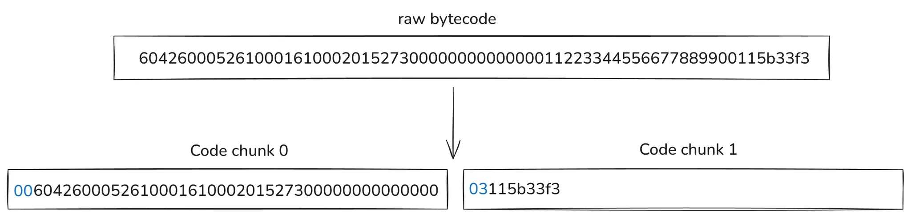

# 31-byte code-chunker

- [31-byte code-chunker](#31-byte-code-chunker)
  - [Background reading](#background-reading)
  - [How does it work?](#how-does-it-work)

## Background reading

To get a proper background on where this code chunker fits into stateless Ethereum, read the [*Trees*](intro.md) introductory chapter and the [*Code chunking*](data-encoding.md#code-chunking) section of *Data encoding*.

## How does it work?

Let’s look at the following example code:

```python
PUSH1 0x42 # 6042
PUSH1 0x00 # 6000
MSTORE # 52
PUSH2 0x0001 # 610001
PUSH2 0x0002 # 610002
ADD # 01
MSTORE # 52
PUSH20 0x0000000000000011223344556677889900115b33 # 73<...>
RETURN # F#
```

The following diagram shows how the code is chunkified:



Recall that an account code is a blob of bytes containing all the contract instructions. The goal of the code chunker is to:

1. Output a list of 32-byte blobs, which will be stored as tree leaves.
2. Given a code chunk without any extra information, an EVM interpreter should be able to detect if a JUMP to any byte in this chunk is valid.

Requirement 1. is easy to understand since each tree leaf stores 32-byte blobs. We can appreciate this requirement being fulfilled since the presented Python code returns a `Sequence[bytes32]`.

Requirement 2. emerges from the fact explained in the *Code chunking* section in the current chapter. Since any `JUMP(I)` can jump to any byte offset in any chunk, an EVM interpreter should be able to detect if this jump is (in)valid without any further information than the code-chunk itself.

The way the 31-byte code chunker resolves this is in the following way:

- The account bytecode is partitioned into slices of 31-bytes in size.
- The first byte contains the number of bytes starting from the 31-byte slice that account for PUSHDATA, i.e., a previous `PUSH(N)` instruction data.

In the diagram, this first byte is shown in blue. Note that the second code chunk indicates that the first 3 bytes correspond to the previous `PUSH20` instruction. This allows the stateless client to note that the `0x5b` byte in this code chunk isn’t a valid `JUMPDEST`!

Using this 1-byte information at the start of the code chunk allows the EVM interpreter to detect if any jump to an offset in the code chunk is valid i.e. `0x5B` is an actual `JUMPDEST`. Given that the bytecode length of a contract is `N` bytes, we know that the number of required chunks is `ceil(N/31)`. If you’re interested in a Python implementation of the chunker, see the [second code snippet here](https://eips.ethereum.org/EIPS/eip-7864#code).

The design of this code chunker is very simple, but the encoding efficiency is not optimal. For example, if a bytecode doesn’t contain any `PUSH(N)` instruction, then we know any `JUMP(I)` is valid, but we’re still only encoding 31-bytes of actual code in 32-byte code chunks. Similarly, if this is an EOF contract, by construction, we know all jumps are valid; thus, we don’t require the extra byte. Soon, we’ll describe other code chunkers with different tradeoffs.
