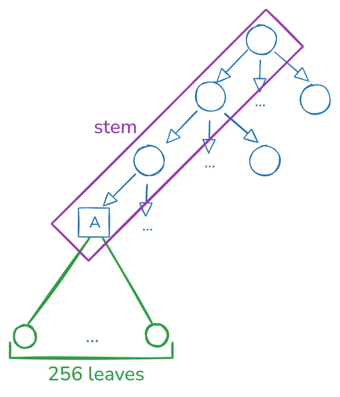

# Data encoding

- [Data encoding](#data-encoding)
  - [Overview](#overview)
  - [Code-chunking](#code-chunking)
  - [Grouping](#grouping)

## Overview

How the Ethereum state is encoded into the tree can significantly impact data inclusion and updating, proof generation, verification, and size. Verkle and Binary Trees share a new way of encoding the data into the tree, so we’ll explore more on this page.

## Code-chunking

In the [parent chapter](intro.md), we mentioned that we need an efficient way of proving slices of any account code. The current proposal encodes the account code bytecode directly in the tree, compared to only storing the code hash as done today.

For key design simplicity, the tree leaves hold 32-byte blobs, which means we need a way to break down account code into 32-byte chunks. Although the most natural approach is partitioning the code into 32-byte chunks and storing it in the tree under some defined tree key mapping for each code chunk, this isn’t enough.

The reason is that there are EVM instructions, i.e., `JUMP` and `JUMPI`, whose arguments contain an arbitrary offset to jump. For the jump to be valid, the target location must be a `JUMPDEST` opcode (`0x5B`). Today, EL clients do a `JUMPDEST` analysis to detect all valid jump destinations in existing code — this analysis requires full code access to detect which bytes are `JUMPDEST` instructions.

In a stateless world, clients only have partial access to code, so they can’t do a complete `JUMPDEST` analysis. For example, an account code has an instruction `PUSH5 0x00115B3344`, which maps to [bytecode](https://www.evm.codes/) `0x6400115B3344`. If a `JUMP(I)` instruction jumps to the fourth opcode, you might think this is valid since it’s a `0x5B`, but this byte corresponds to the data of `PUSH5`, not a valid `JUMPDEST`. A stateless client must be sure which `0x5B` bytes correspond to real `JUMPDEST` to perform `JUMP(I)` validations **without** requiring all the account’s code.

This means that the code chunkification strategy should not only slice the account’s code into 32-byte chunks but also in a way that allows an EVM interpreter receiving these chunks to detect invalid `JUMP(I)` instructions.

In the 31-byte code chunker page, we explore the currently proposed code chunker in more detail. This book will soon include other proposal candidates for code chunkers, so watch for updates!

It’s worth noting that if the [EOF upgrade](https://evmobjectformat.org/) is deployed to the mainnet, the problem of invalid jumps would be solved for contracts using this format. This doesn’t mean we can completely forget about it since only newly created EOF contracts could avoid this problem, but we still have to support legacy contracts probably forever.

## Grouping

If we think carefully about how usual EVM code is executed in blocks, we can note two facts:

- Accounts’ basic data, such as *nonce* and *balance,* are usually accessed together.
- Whenever a storage slot `A` is accessed, there’s a high probability that nearby storage slots are also accessed.
- Although code execution isn’t perfectly linear, if we execute code chunk `A`, there’s a high chance we’ll execute code chunk `A+1`.

In other words, state access during a block execution isn’t random.

This is an optimization opportunity since if we group states frequently accessed together in the same tree branch, proving the whole state requires fewer tree branches, making the state-proof size smaller.

The current proposal is creating groups of 256 leaves, which can be depicted in the following diagram:

Please don’t focus on the tree arity since this will depend on the underlying tree design. The main point is that given a *stem*, we encode 256 leaves in that single branch, and we expect these values to have a high probability of being accessed together. Choosing a size of 256 is entirely arbitrary, but for historical reasons rooted in Verkle Trees proving efficiency. For Binary Trees, there’s more flexibility in choosing a different size.

Note that these 256 values can contain any arbitrary data. The current proposal has the following stem types:

- An *account stem* contains:
  - One leaf encodes the nonce, balance, and code size.
  - One leaf encodes the code hash.
  - 64 leaves being the first 64 storage slots.
  - 128 leaves being the first 128 code chunks.
  - The unused leaves are reserved for potential future use.
- An *account storage stem* contains 256 consecutive storage slots for an account, excluding the first 64 storage slots that live in the *account stem*.
- An *account code stem* contains 256 consecutive code chunks of the account’s code, excluding the first 128 code chunks that live in the *account stem*.

Each account property (nonce, balance, etc.), storage slot, and code-chunk grouping is done by defining a proper tree key mapping. The way this is done depends on the specific tree proposal. Still, the general strategy is defining a function that generates the first 31 bytes for the 32-byte tree key, defining the *stem*, and the last byte indicates which of the 256 leaves corresponds to the required data.

For example, as mentioned in the above bullets, the storage slots `3` and `4` live in the *account stem*. The account stem defines the first 31 bytes of the tree key, so both storage slots share this byte prefix. Their last tree-key byte is `HEADER_STORAGE_OFFSET+3` and `HEADER_STORAGE_OFFSET+4`, respectively. `HEADER_STORAGE_OFFSET` currently is `64`, meaning in the group of size 256, we store the first 64 slots at offset 64.
