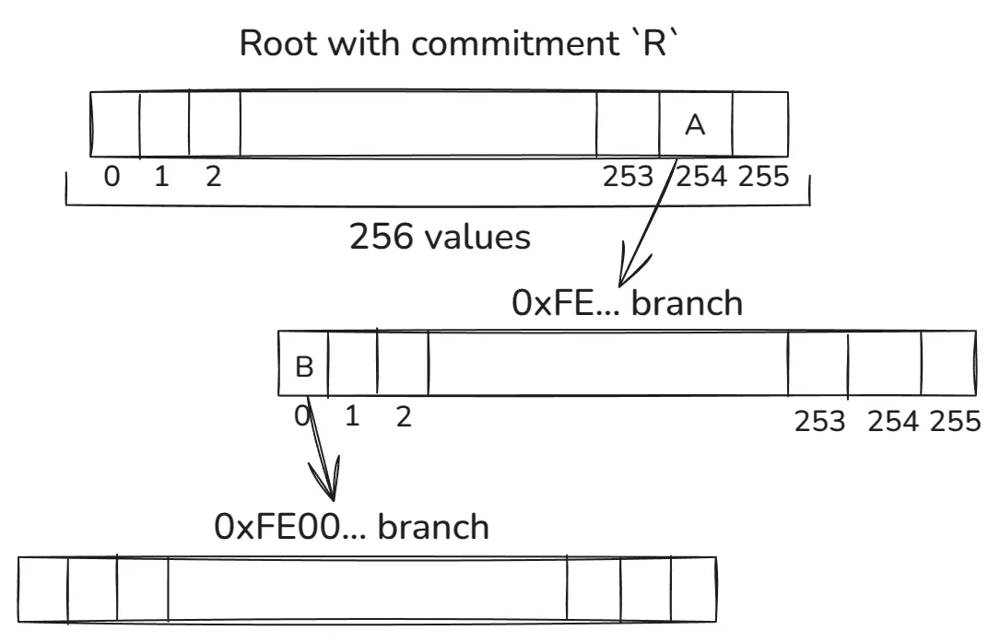
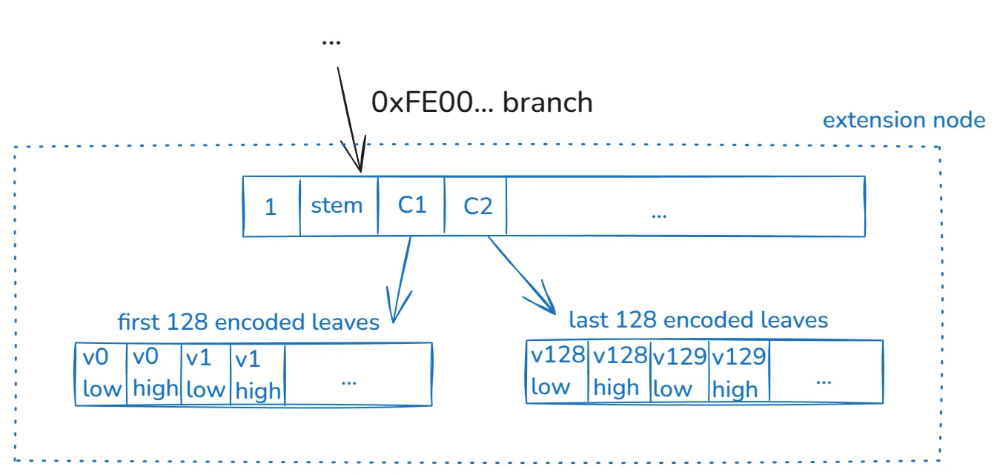

# Verkle Tree

- [Verkle Tree](#verkle-tree)
  - [Overview](#overview)
  - [Role of vector commitments in the design](#role-of-vector-commitments-in-the-design)
  - [Tree design](#tree-design)
  - [Proof Construction](#proof-construction)

## Overview

Verkle Trees was the first tree design considered a viable solution for stateless Ethereum. The roots live in a [paper](https://math.mit.edu/research/highschool/primes/materials/2018/Kuszmaul.pdf) published by [John Kuszmaul](https://sites.google.com/view/johnkuszmaul). This idea superseded older Binary Trees approaches from years ago when SNARK proofs were still sci-fi technology.

Due to advancements in SNARK proving systems performance and concerns about quantum risks, Verkle Trees might be superseded by [Binary Trees](binary-tree.md). This is still under discussion; stay tuned!

## Role of vector commitments in the design

At the core of Verkle Trees’ design is using a cryptographic component named *vector commitment.*

Without getting into formal definitions, this construct allows us to fill a vector with fixed size `N` and:

- Compute a *commitment* to the vector, a succinct fingerprint of its contents.
- Given the *commitment*, we can efficiently generate a small proof to prove that a particular entry in the vector has a defined value.
- For Verkle Trees, `N = 256` for proof efficiency reasons.

This construct addresses a fundamental problem with high-arity trees, such as the current Merkle Patricia Trie (MPT). For an MPT Merkle proof, each internal node in a branch must provide 15 siblings so the verifier can calculate the corresponding hash, verifying all the branches chain up to the root. This means the arity is a significant amplification factor for the proof size.

If we instead use vector commitments to represent child commitments, the construct allows us to generate proof only for the required children. Said differently, the proof size isn’t linear to the vector length.

The cryptography around the vector commitments is based on [Inner Product Arguments](https://dankradfeist.de/ethereum/2021/07/27/inner-product-arguments.html) and [Multiproofs](https://dankradfeist.de/ethereum/2021/06/18/pcs-multiproofs.html). This construction allows the generation of proofs without trusted setups and aggregates multiple vector openings into a single proof. This means that if we need to prove the openings of multiple vectors at different positions, we can generate a unique short proof of all those openings. This is precisely what we need for state proofs in this tree since proving a branch means doing one opening per internal node in the branch to connect all the vector openings up to the expected root.

## Tree design

A tree key is still a 32-byte blob. The first 31-bytes define what’s called a *stem*. A *stem* decides the main branch from which all 256 values for that *stem* will reside. Note that the last byte of the tree key defines exactly 256 values; thus, we can conclude that the first 31-bytes define the tree key path, and the last byte defines which bucket from the 256 items contains the value.

Let’s look at the following diagram to understand how the *stem* maps to the tree path:

Each byte of the *stem* defines which item from each internal node from each level is used to walk down the path. This is shown by the `0xFE...` and `0xFE00...` examples depending on which path we use to walk down the tree. The `A` and `B` are vector commitments to the corresponding pointed vectors.

Given a *stem*, we always walk downstream until we reach a point where no other *stem* exists in the corresponding sub-tree. At this point, we insert the leaf node for the *stem*.

Continuing with our example, we see that after the first two levels, we reached an *extension node:*

This construct (*extension node*) encodes the 256 values of the *stem.* As previously mentioned, in this example, no other *stems* exist in the tree with the prefix `0xFE00`— if that were the case, we’d have more internal nodes branching the tree.

This extension node is constructed in the following way:

- As usual, a 256 vector with the first 4-items encoding:
  - The value `1` to prove this vector corresponds to an extension node.
  - The `stem` value. Recall that the path can’t fully describe this value.
  - `C1` and `C2`, which are commitments to two vectors
- A 256 vector encoding the first 128 values of this *stem*. Each value is represented in two items. The commitment of this vector is the `C1` mentioned above.
- An analogous 256-vector mentioned in the previous bullet, but for the last 128 values of this *stem*, which has commitment `C2`.

The main reason why we need to encode each 32-byte value in two buckets is related to the vector commitment construct. Each item in the vector is a scalar field element of a defined elliptic curve. This scalar field size is less than 256 bits. Thus, we need two finite field elements to encode a 32-byte value. Encoding also has a further rule distinguishing between written zeros and empty values.

We suggest reading [this article](https://blog.ethereum.org/2021/12/02/verkle-tree-structure) to understand other details about the design.

## Proof Construction

This section provides a high-level overview of how the proof is constructed.

At a high level, a block execution requires proving a set of key values from the tree so a stateless client can re-execute the block. Each key-value corresponds to a branch and a particular item in its corresponding *extension node*. Multiple key values might share the same main branch (i.e., *stem*).

The proof needs to do each corresponding vector opening from the *extension node* up to the tree root. In our example above, if we want to prove `v1` value, we’d have to do the following openings:

- For `C1` at position 2 proving has value `v1_low`.
- For `C1` at position 3 proving has value `v1_high`.
- For `B` at position 0 proving has value `1`
- For `B` at position 1 proving has value `stem`.
- For `B` at position 2 proving has value `C1` (note that opening `C2` is not needed!).
- For `A` at position 0 proving has value `B`.
- For `R` at position 254 proving has value `B`

Given the list of key values to prove, many might share openings that are only done once. The proof contains extra information to decide how the verifier should expect each stem to map to tree branches.

Note that the prover does not provide `R` since it’s known to the verifier, i.e., it is the state root of the tree. As mentioned before, all these vector openings are batched in a single proof, which compresses all the openings in a single short proof.

 We recommend reading [this article](https://ihagopian.com/posts/anatomy-of-a-verkle-proof) if you want a more in-depth explanation of proof construction.
