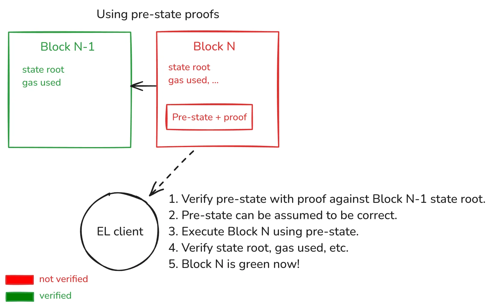
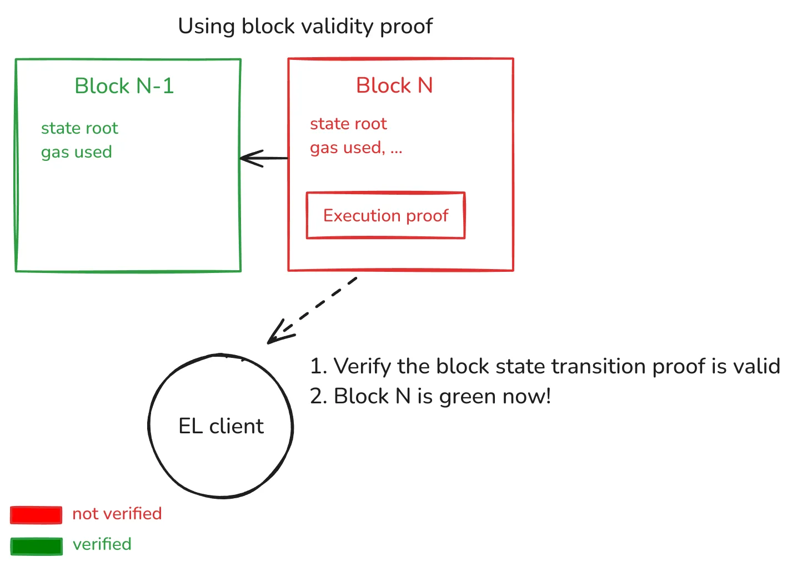
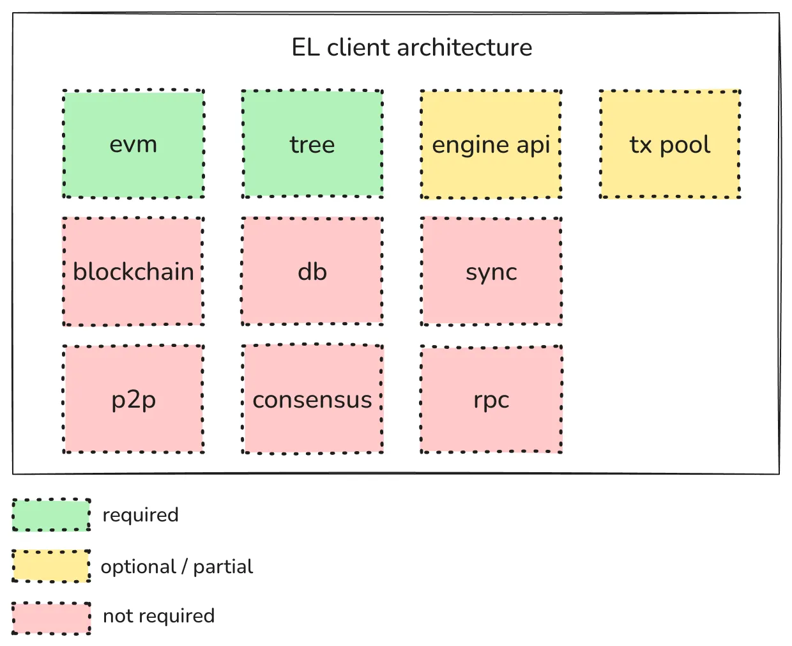

# Stateless clients

- [Stateless clients](#stateless-clients)
  - [Overview](#overview)
  - [Block verification and required state](#block-verification-and-required-state)
  - [How would they work?](#how-would-they-work)
  - [Stateless clients as validators](#stateless-clients-as-validators)
  - [Stateless client architecture](#stateless-client-architecture)

## Overview

A stateless client is a client that can *trustlessly* verify a blockchain block without storing the whole Ethereum state. T*rustlessly* is the keyword here — compared with light clients, which rely on an external party to provide the required state to verify the block. Stateless clients can also be named *secure light clients*.

But what are the blockers for stateless clients to be a reality? As explained in the [*Trees* chapter](../trees/intro.md), the Ethereum state is merkelized; thus, we can create Merkle proofs. However, the problem relies on how big these proofs are, which can become a problem for network distribution and security. All the protocol changes described in this book aim to allow efficient enough proofs to allow stateless clients to participate in the network sustainably and in the worst-case scenarios.

## Block verification and required state

Let’s better understand the relationship between the Ethereum state and block verification.

To do this, let’s imagine we’re trying to verify a block that contains a single transaction sending 10 ETH from `account A` to `account B`. Omitting some details and just using common sense; we need to check that `account A` has enough balance for the ETH transfer and gas fees. If this isn’t the case, the transaction must fail.

Note that when a block is received with this transfer, an EL client can’t predict which will be `account A`, so a priori must have this information for all Ethereum accounts. Not doing so means that a potential transaction would make verifying this block impossible for a stateless client. Stateful clients could still verify, but presumably be the minority. More advanced transactions, such as ones that execute contracts, work the same — clients must have accounts contract code and storage state since blocks can contain transactions involving any existing contract.

The main insight is that given a block with transactions, **the amount of state that we need to verify the block is orders of magnitude smaller than the complete state**. Even further, there’s Ethereum state that hasn’t been used for years but is still required since at any point in time a new transaction touching this state could appear. This tangentially surfaces the need for supporting *State Expiry* in the protocol, which will be a future chapter in this book.

## How would they work?

The following diagram depicts how a stateless clients relying on pre-state proofs would work:

In a fully SNARKified L1 world:

In this setup, the proof is fully proving that the state transition with public inputs:

- `Block N-1` state root (i.e., pre-state).
- `Block N` hash.
- `Block N` state root (i.e., expected state after executing the tx list on top of pre-state).

This allows us to push further L1 scaling since *EL Client* doesn’t have to do any EVM code execution, and the only computational cost is verifying the proof.

There is active research and proposals that might change how execution payloads are validated and executed (e.g., delayed validation). On this page, we stick to how the current protocol works but stay tuned since the book will continue to be updated if these changes are included.

## Stateless clients as validators

The above explanations focused on stateless clients verifying the validity of the blockchain without trusting external parties, which is the ethos of Ethereum. However, stateless clients can go further and participate as validators in the network.

Not having the full state means they can’t be block builders since generating the proof indirectly requires having access to the state. This doesn’t mean stateless clients can’t be validators since many validators today delegate the task of block builders to external parties (e.g., using [MEV-boost](https://boost.flashbots.net/)). They could still receive the candidate block with the corresponding proof, verify it is correct, and then propose it to the network.

The implications of stateless validators are an active area of research since they’ve deep implications for network topology and security. Soon, new chapters will be added to the book to explore this topic further.

## Stateless client architecture

One benefit of having stateless clients is that they’re simpler to implement compared with a full-node.

Let’s look at the following diagram:

- An *EVM* implementation is required since block execution is needed.
- A *Tree* implementation is required since the new state root must be calculated.
- The *Engine API* and *Txn pool* should be implemented partially or optionally.
- A full node involves the rest of the components but isn’t strictly required by a stateless client.
